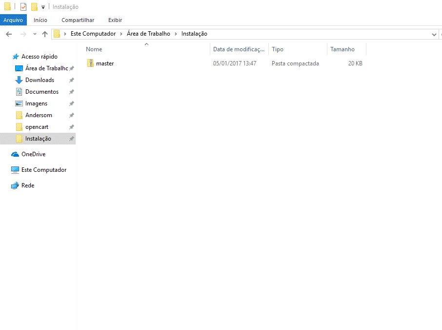
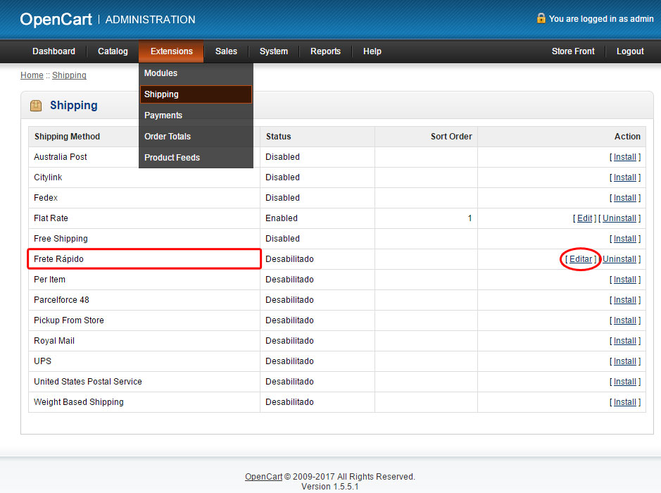
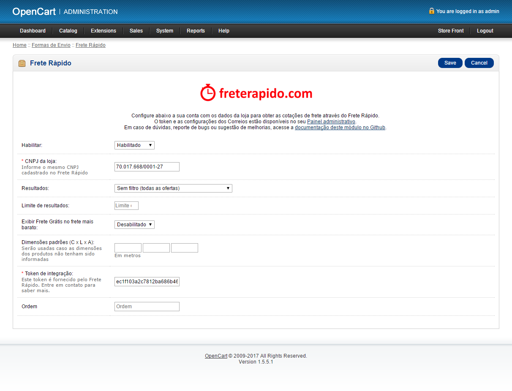
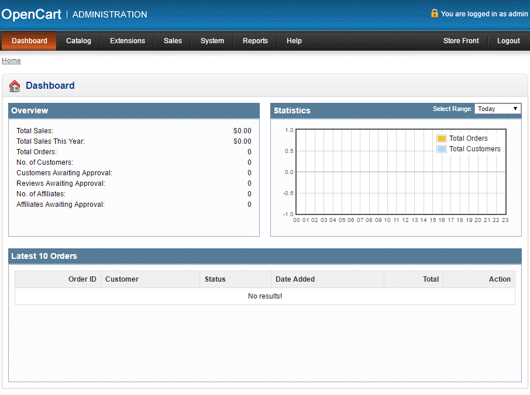
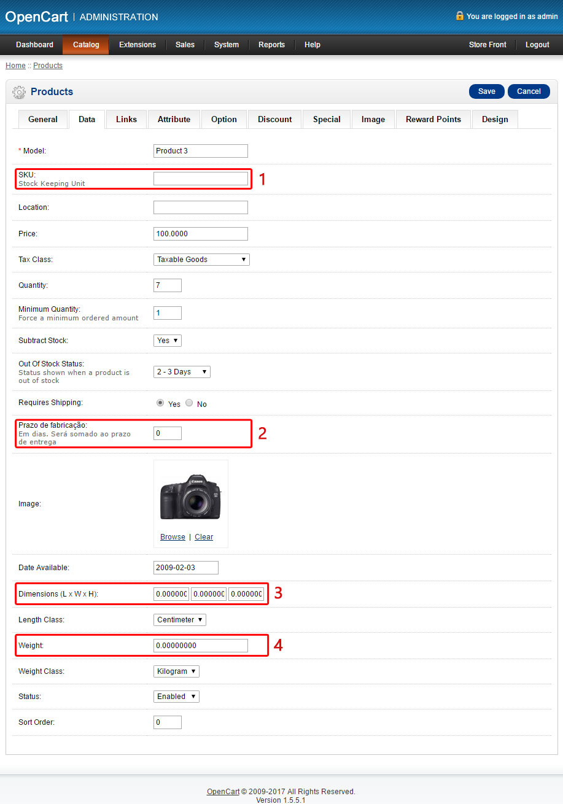
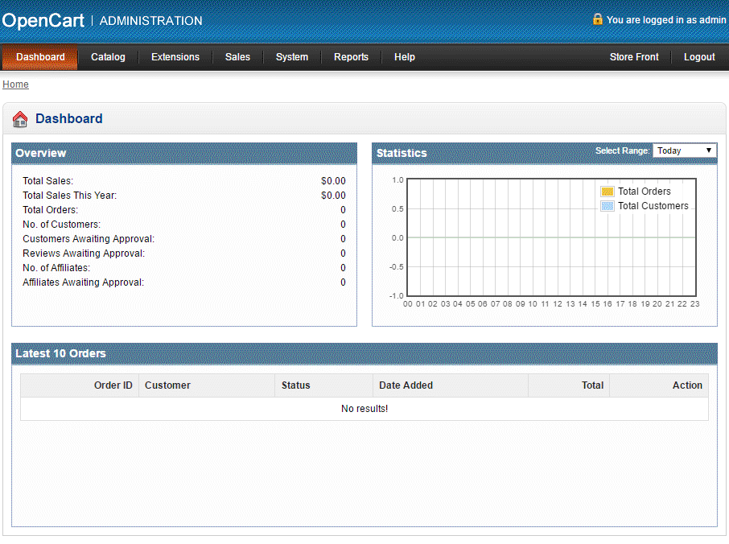
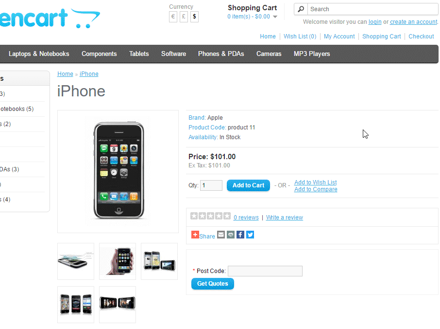
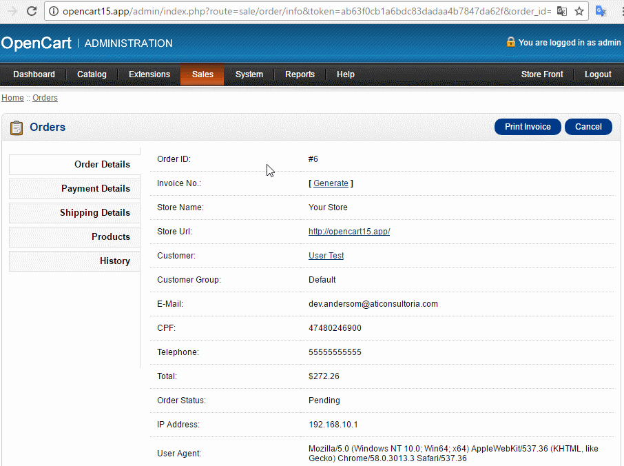

### **Módulo para plataforma OpenCart**

Versão do módulo: 1.0.2

Compatibilidade com OpenCart: **1.5.x**

Links úteis:

- [OpenCart Extension Store][1]
- [Painel administrativo][2]
- [suporte@freterapido.com][3]

-------------

### IMPORTANTE

Este módulo é apenas um referencial de integração e cabe ao cliente a função de configurá-lo e adaptá-lo a sua respectiva loja, levando em conta as particularidades e conflitos que podem surgir durante o processo de integração.

A Frete Rápido não mantem e/ou oferece suporte para a integração com o **OpenCart**, apenas disponibilizamos um módulo de integração padrão que atente a maioria dos e-commerces que utilizam esta plataforma.

**Este módulo não opera Dropshipphig!**

Para qualquer modificação neste módulo, baseada no modelo de negócio do seu e-commerce, é possível alterar o código fonte antendendo a  [API da Frete Rápido][9]. E [neste link][8] você encontra a documentação de modificações do **OpenCart**.

A Frete Rápido não se responsabiliza por eventualidades advindas deste módulo.

--------------

### Instalação

>**ATENÇÃO!** Recomendamos que seja feito backup da sua loja antes de realizar qualquer instalação. A instalação desse módulo é de inteira responsabilidade do lojista.

- [Baixe aqui a última versão][4] ;
- Descompacte/Extraia o arquivo “zip” que baixou;
- Copie todo o conteúdo extraído para o diretório raiz da sua loja;
- Agora, acesse a área administrativa de sua loja para concluir a instalação. Conforme imagem abaixo.

- Você precisa ir em **Extensions > Shipping**, procurar o plugin "**Frete Rápido**" na listagem "**Shipping**" e clicar no botão **Install**.

")

----------

### Configurações

#### 1. Configurações do módulo:

- Agora, configure o módulo em **Extensions > Shipping**, procure o plugin "**Frete Rápido**" na listagem "**Shipping**" e clique no botão **Editar**.

- **Habilitar:** Habilita ou desabilita o módulo conforme sua necessidade.
- **CNPJ da loja:** CNPJ da sua empresa conforme cadastrada no Frete Rápido.
- **Resultados:** Define como deseja receber as cotações.
- **Limite de resultados:** Define a quantidade máxima de cotações que deseja obter.
- **Exibir Frete Grátis no frete mais barato:** Apresenta para o cliente da loja o frete mais barato como **Frete Grátis**.
- **Valor Mínimo Frete Grátis:**  Define o valor mínimo para ativar a regra de **Frete grátis**. Para valor **indefinido**, informe **0**.
- **Dimensões padrões (C x L x A):** Permite informar dimensões padrões de encomendas, geralmente usado quando se tem um único tipo de encomenda.
- **Token de integração:** Token de integração da sua empresa disponível no [Painel administrativo do Frete Rápido][2] > Empresa > Integração.
- **Ordem:** Ordenação do plugin na sua loja.

> **Obs:** É importante informar todos os campos corretamente.

#### 2. Medidas e Peso

Para total usabilidade do módulo **Frete Rápido**, é necessário realizar algumas configurações na sua loja.

- É necessário informar alguns dados de cada produto em: **Catalog > Products > Edit** (por produto) **>** aba **"Data"**.

>**1. SKU:** Sugerimos definir um SKU para cada produto da sua loja. Não é obrigatório, mas se o SKU estiver definido, será possível realizar uma análise junto ao Frete Rápido.

>**2. Prazo de fabricação:** Informe um prazo de fabricação do produto, caso necessário. Esse prazo adicional será acrescido ao prazo de entrega.

>**3. Dimensões (C x L x A):** Informe os valores de medidas do produto (Comprimento, Largura e Altura).

>**4. Peso:** Informe o peso do produto.

> **Atenção:** Considerar as dimensões e peso do produto com a embalagem pronta para envio/postagem.
> É obrigatório ter o peso configurado em cada produto para que seja possível cotar o frete de forma eficiente. As dimensões podem ficar em branco e neste caso, serão utilizadas as medidas padrões informadas na configuração do plugin, mas é recomendado que cada produto tenha suas configurações próprias de peso e dimensões.

#### 3. Categorias

- É necessário relacionar cada categoria da sua loja com as categorias do Frete Rápido em: **Catalog > Categories > Edit** (por produto) **>** aba **"Data"**.

> **Obs:** Nem todas as categorias da sua loja podem estar na relação de categorias do Frete Rápido, mas é possível relacioná-las de forma ampla.
>
> **Exemplo 1**: Moda feminina --> Vestuário
>
> **Exemplo 2**: CDs --> CD / DVD / Blu-Ray
>
> **Exemplo 3**: Violões --> Instrumento Musical

#### 4. Campo de CPF no cadastro de Usuário

- Para que você consiga contratar os fretes através da sua loja, é necessário adicionar um campo no formulário de cadastro dos usuários para armazenar o **CPF**.
Nós desenvolvemos uma extensão que faz isso para você automaticamente. Para usá-la, basta acessar a documentação dela [neste link][7].

--------

### Observações gerais:
1. Para obter cotações dos Correios é necessário configurar o seu contrato com os Correios no [Painel administrativo do Frete Rápido][2] > Empresa > Integração.
2. Esse módulo atende cotações apenas para destinatários Pessoa Física.

----------

### Cálculo do frete na página do produto

Para cálculo do frete na página do produto, você precisa utilizar o plugin [Simular Frete no Produto][6], disponível na loja oficial da plataforma OpenCart.
Após instalar o plugin, sua página do produto deverá apresentar o campo para calcular o frete com base no CEP.

--------

### Contratação do frete

Para contratar um frente você precisa:

- Acessar Sales > Orders > [Uma ordem selecionada] > Aba **History**.
- Trocar o campo **Order Status** de **À espera do envio**.
- Clicar no botão **Add History**.

> **Obs**: Na aba **Shipping details** você encontra o código de rastreio do frete no campo **código do frete contratado no Frete Rápido**. Ao clicar sobre o código, você será direcionado à página de rastreio desse frete.

--------

### Contribuições
Encontrou algum bug ou tem sugestões de melhorias no código? Sencacional! Não se acanhe, nos envie um pull request com a sua alteração e ajude este projeto a ficar ainda melhor.

1. Faça um "Fork"
2. Crie seu branch para a funcionalidade: ` $ git checkout -b feature/nova-funcionalidade`
3. Faça o commit suas modificações: ` $ git commit -am "adiciona nova funcionalidade"`
4. Faça o push para a branch: ` $ git push origin feature/nova-funcionalidade`
5. Crie um novo Pull Request

--------

### Licença
[MIT][5]

  [1]: https://www.opencart.com/index.php?route=marketplace/extension/info&extension_id=30147&filter_search=frete%20r%C3%A1pido "OpenCart Extension Store"
  [2]: https://freterapido.com/painel/?origin=github_opencart_1.5.x "Painel do Frete Rápido"
  [3]: mailto:suporte@freterapido.com "E-mail para uma galera super gente fina :)"
  [4]: https://github.com/freterapido/freterapido_opencart_1.5.x/archive/master.zip
  [5]: https://github.com/freterapido/freterapido_magento/blob/master/LICENSE
  [6]: https://www.opencart.com/index.php?route=marketplace/extension/info&extension_id=25506&filter_category_id=5&filter_license=free
  [7]: https://github.com/freterapido/opencart_1.5.x_cpf_checkout
  [8]: http://docs.opencart.com/developer/module/
  [9]: https://www.freterapido.com/dev/
